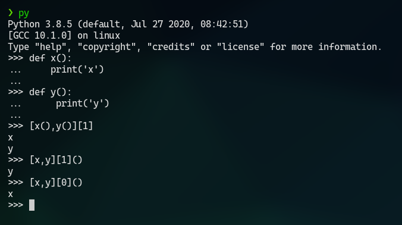

##### Use a single function for taking input.
**UPDATE:** Thinking about this a little more, I think that the input should be a tuple, list, and the returned value should be the index of the option selected. (i.e. show the options using `index+1`)
This will allow for some neat tricks (see above picture for reference about what the hell I am talking about)

And, moreover so, how the hell are you gonna traverse a dictionary reliably? It does not have any order!

So I commented out the obsolete part
<!--  {{{1

It could be something that takes a dictionary as argument.

Name - `choose_option()` ?

```python
input_dict = {
  'arg1' : 'text1',
  'arg2' : 'text2'
}
user_choice = choose_option(input_dict)
```

It will show something like -

    arg1. text1
    arg2. text2

    choose your option:

Or maybe -

    1. text1
    2. text2

    choose an option:

But whichever it may be, the function shall return `arg1` or `arg2`, not `1` or `2`
And it shall be used everywhere

Something like -
while true:
  .
  .
  .
  return

##### Also use a single function for taking confirmation [Y/n]

Name - `yes_or_no()` ?

the function shall take a string as input (containing the '?') and append '[Y/n]' to it, and then wait for user input
as usual, it shall be inside a `while true` loop, and shall check for all combinations of yes and no.

It shall return a `True` or `False`

### and keep these functions inside a module? or maybe a class?

}}} -->

## Ctrl-C Ctrl-V
Possibly implement this in the main() function or the main loop.
|Press|Causes|Action|
|-|-|-|
| Ctrl-V | EOFError in any input() | yes_or_no("Logout?") |
| Ctrl-C | KeyboardInterrupt | print("\nAborted!"); sys.exit(130) |

## Users are classes
Implement three classes - Guest, User and Admin <br>
On login, initiate a class into variable <br>
on logout, delete that variable <br>
e.g. `user=User()` <br>
`del user`

## Constants/configuration
Create a separate config.py or constants.py from where the settings/constants <br>
like _hostname_ (ip/socket of database) <br>
_database_ (name of the database) <br>
_admin username_, _guest Username_, _tenant username_, etc. <br>
These shall be **overrides** over the default values <br>
i.e after importing the config.py check if all expected values are there. <br>
if no, then assign the defaults to them (i.e. like in `vim-iawriter`)

# Hotel Database
- No. of beds
- Air-conditioned?

### Guest
- Check for empty rooms
- Check rates (also from database - make a `rates` table?)
```sql
grant select on `hotel database` . `rates` to 'guest'@'localhost';
grant select(`room number`), select(`room type`), select(`occupied`) on `hotel database` . `rooms` to 'guest'@'localhost';
```

### Tenants
- Identified by ROOM NO. PRIMARY KEY
- Password set on entry creation (i.e. By Admin) NOT NULL
- Options -
    - Change password
    - Check details
    - Change details
        - Each person identified by person id PRIMARY KEY
        - Name NOT NULL
        - Age
        - Gender
        - Phone no.
        - ID Proof type
        - ID proof unique id

To be done by login manager
```sql
grant all on `hotel database` . * to 'tenant'@'localhost' with grant option;
```

### Admin
- Add/remove rooms
- Change room details
- change `rates` table
- add people/remove people by dropping and creating tables
- add details/change details
- make rooms empty/occupied
```sql
grant all on `hotel database` . * to 'admin'@'localhost' with grant option;
```

### Login manager
```sql
grant select(`room number`), select(`password`) on `hotel database` . `rooms` to 'login manager'@'localhost' with grant option;
```
On new login attempt -
```sql
revoke all on `hotel database`.* from 'tenant'@'localhost';
```
On successful login attempt (to be done by login manager from python main program)
```sql
grant all on `hotel database`.`<successfully authenticated room number to be inserted by python here>` to `tenant`@`localhost`;
```

## Rough outlines
- `Rates` table
  - room type `PRIMARY KEY` int
  - no of beds
  - air-conditioned?
  - rate (per day)
- `ROOMS` table
  - room number `primary key`
  - room type `foreign key` int `references` rates table
  - occupied? `bool`
    - While `SELECT`ing, make sure to replace `TRUE` --> Occupied and `FALSE` --> Free
  - ROOM password varchar(?) -- used to store `sha2('',0)` hash of the room's password.
    - ###### Take extra care to not include in `SELECT`
- `<insert room number here>` table --- i.e. each room gets it's own table
  - id `int` `PRIMARY KEY` `AUTO_INCREMENT`
  - name NOT NULL
  - age NOT NULL
  - gender
  - phone number
  - minor `bool`
  - ID type ``check ((NOT `minor`) OR (`ID type` IS NOT NULL))``
  - ID number ``check ((NOT `minor`) OR (`ID number` IS NOT NULL))``
  - room `FOREIGN KEY` `REFERENCES` `` `ROOMS` (`room type`) ``
  - `ON DELETE CASCADE`
- `ROOM login` table **(deprecated -- not to be implemented)** --- shall be included in `rooms` table itself
  - Used to store `sha2('password',0)` hashes so that room tenants can login into their rooms and add/alter/drop details as required
  - room number primary key int
  - room password varchar(?) - stores sha2 hashes
  - ``FOREIGN KEY (`room number`) REFERENCES `ROOMS` (`room number`)``
  - can _only_ be **read** by `loginuser` (except `admin`, of course)
  - ***NOTE:*** DO NOT send sha2 hash to python client for checking! Accept sha2 hash from client and check _in situ_ using `strcmp()`. Only return `TRUE` and `FALSE`
